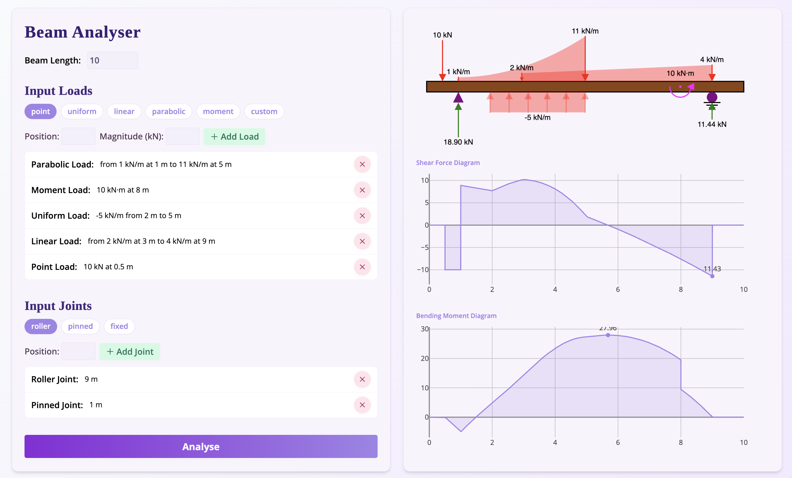

# Beam Analyser

### [Check it out here!](https://kinetictactic.github.io/BeamAnalyser/)

A modern, interactive web app for visualizing and analyzing beams under various loads and supports. Built with Svelte, Vite, Plotly.js, p5.js, and Tailwind CSS.



## Features

- 🏗️ **Beam Modeling**: Define beam length, add point loads, distributed loads, and supports.
- 📊 **Interactive Visualization**: View real-time beam diagrams, Shear Force Diagrams (SFD), and Bending Moment Diagrams (BMD).
- 🎨 **Custom loads**: Support for user-defined load functions like `2x + 5sin(3x)`.
- 📱 **Responsive Design**: Works great on desktop and mobile, with adaptive layout.
- 🧮 **Robust Validation**: Input validation and error highlighting for reliable results.
- 🔗 **Open Source**: MIT licensed and available on [GitHub](https://github.com/KineticTactic/BeamAnalyser).

## Acknowledgement

This is a project given by our ME101 (Engineering Mechanics) Instructor, [Professor Tapan Krishnakumar Mankodi](https://www.iitg.ac.in/mech/faculty/tapan-krishnakumar-mankodi/). I am grateful to him for giving me a chance to utilise and apply the concepts he taught in class in a real, hands-on project.

## Development Process

### Prerequisites

- [Node.js](https://nodejs.org/) (v18+ recommended)
- [pnpm](https://pnpm.io/) (or use npm/yarn)

### Installation

```bash
pnpm install
```

### Development

```bash
pnpm dev
```

Open your browser to [http://localhost:5173](http://localhost:5173) to use the app.

### Build for Production

```bash
pnpm build
```

## Project Structure

- `src/lib/` — Svelte components, beam logic, and assets
- `src/routes/` — Main app layout and routing
- `static/` — Static files (robots.txt, favicon, etc.)

## Technologies Used

- [Svelte](https://svelte.dev/)
- [Vite](https://vitejs.dev/)
- [Tailwind CSS](https://tailwindcss.com/)
- [Plotly.js](https://plotly.com/javascript/)
- [p5.js](https://p5js.org/)
